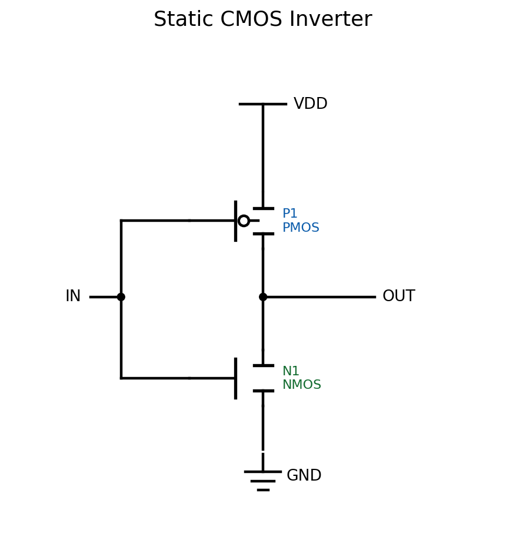
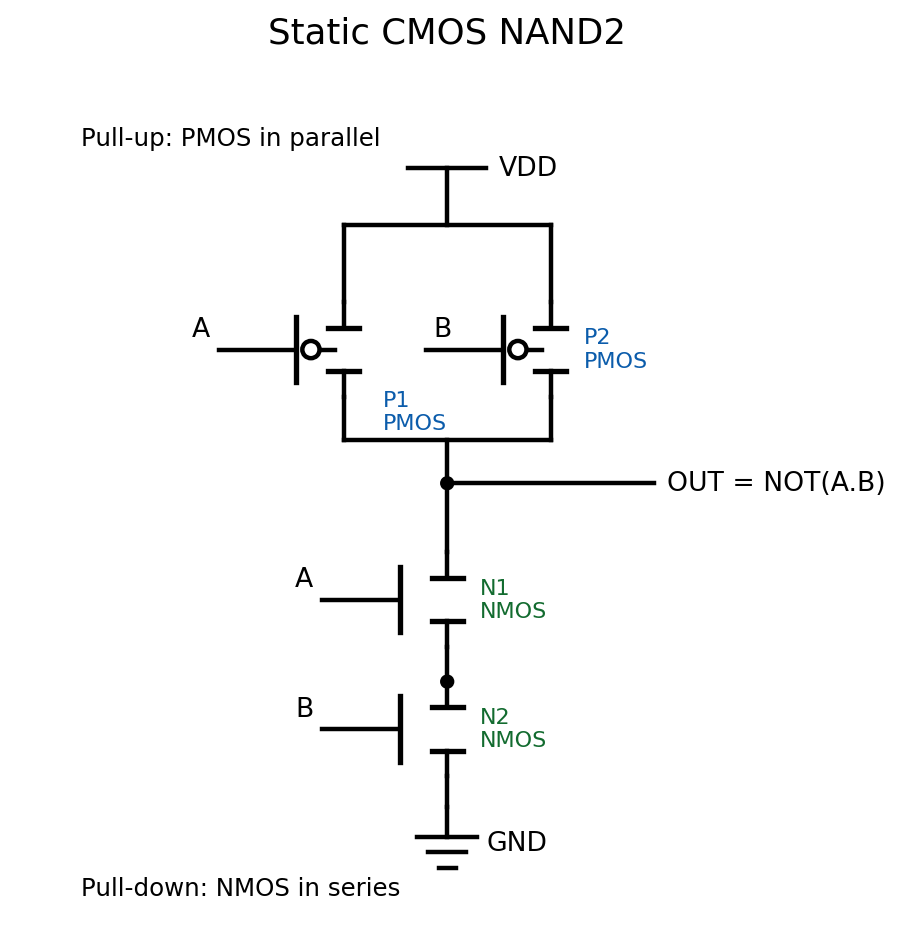
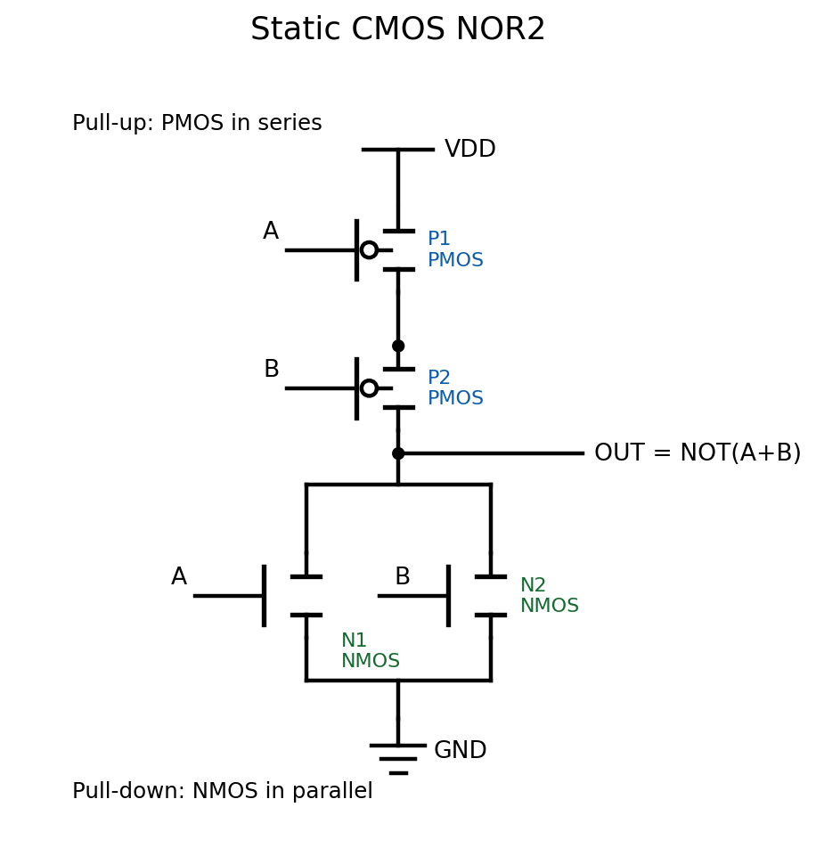
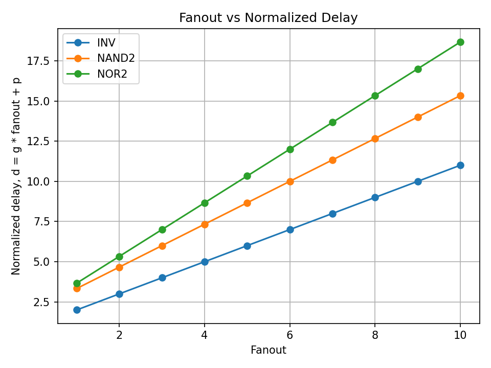
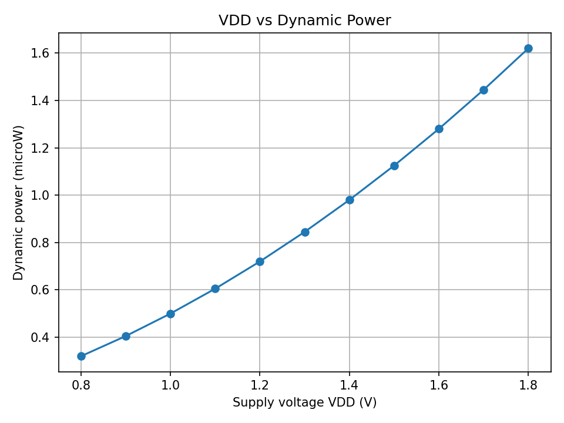
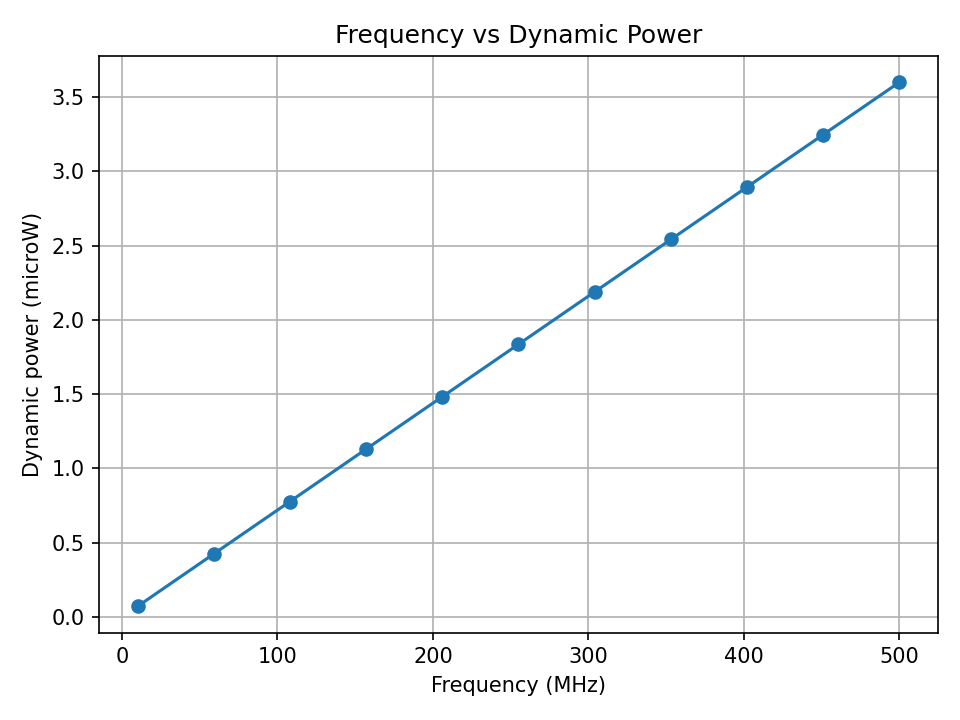
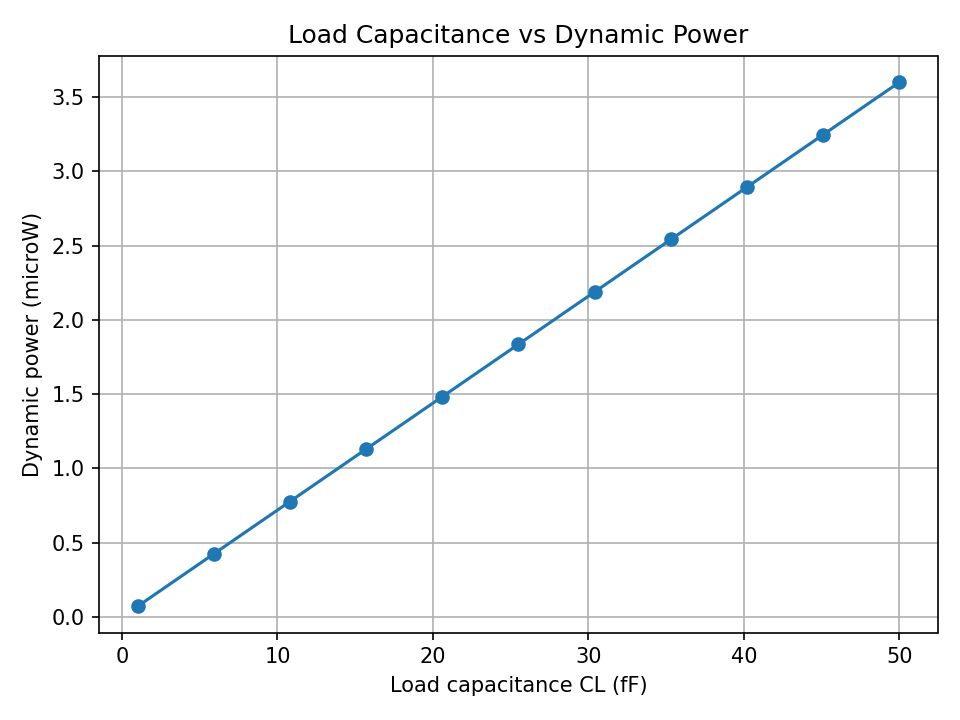

# CMOS Delay and Power Analysis

This beginner-friendly Python project analyzes three basic static CMOS logic gates:

- Inverter (`INV`)
- 2-input NAND gate (`NAND2`)
- 2-input NOR gate (`NOR2`)

The project uses simple equations that are common in digital integrated circuit design. It is meant for learning and quick comparison, not detailed transistor-level simulation.

## What The Project Calculates

### 1. Normalized Logical Effort Delay

The delay model is:

```text
d = g * fanout + p
```

where:

- `d` is normalized delay
- `g` is logical effort
- `fanout` is the load driven by the gate
- `p` is parasitic delay

The gate parameters are:

| Gate | g | p |
| --- | --- | --- |
| INV | 1 | 1 |
| NAND2 | 4/3 | 2 |
| NOR2 | 5/3 | 2 |

### 2. Dynamic Power

The dynamic power model is:

```text
Pdyn = CL * VDD^2 * frequency * switching_activity
```

where:

- `CL` is load capacitance in farads
- `VDD` is supply voltage in volts
- `frequency` is switching frequency in hertz
- `switching_activity` is the probability of switching per clock cycle

## Project Structure

```text
cmos-delay-power-analysis/
  src/
    gates.py
    delay_model.py
    power_model.py
    plot_results.py
  plots/
  data/
  reports/
  README.md
  requirements.txt
```

## How To Run

1. Install Python 3.

2. Install the required packages:

```bash
pip install -r requirements.txt
```

3. Generate the plots:

```bash
python src/plot_results.py
```

The generated images will be saved in the `plots` folder:

- `fanout_vs_delay.png`
- `vdd_vs_power.png`
- `frequency_vs_power.png`
- `capacitance_vs_power.png`

## Notes For Students

- Delay increases with fanout because a gate needs more time to charge or discharge a larger load.
- Dynamic power increases with capacitance, frequency, and switching activity.
- Dynamic power has a squared dependence on `VDD`, so increasing supply voltage can strongly increase power.

## Interpretation of Results

### Fanout vs Delay
The fanout-delay plot shows that delay increases as fanout increases. This happens because a larger fanout means the gate must drive more input capacitance. The inverter has the smallest delay because it has the lowest logical effort. NAND2 is slower than the inverter, and NOR2 is the slowest among the three because its logical effort is larger.

### VDD vs Dynamic Power
The VDD-power plot shows a nonlinear increase in dynamic power. This is because dynamic power is proportional to VDD squared. Therefore, increasing the supply voltage has a strong effect on power consumption.

### Frequency vs Dynamic Power
The frequency-power plot shows a linear increase. As switching frequency increases, the load capacitance is charged and discharged more often, so dynamic power increases.

### Load Capacitance vs Dynamic Power
The capacitance-power plot also shows a linear increase. A larger load capacitance requires more energy to switch, which increases the dynamic power.

## Project Outputs

### Static CMOS Inverter



### Static CMOS NAND2



### Static CMOS NOR2



### Fanout vs Normalized Delay



### VDD vs Dynamic Power



### Frequency vs Dynamic Power



### Load Capacitance vs Dynamic Power




